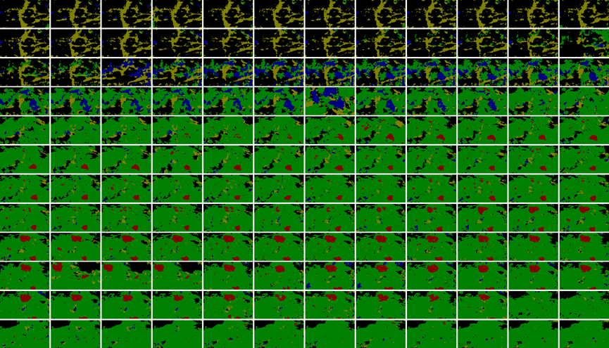

# Image Segmentation with Contrastive Learning for Plant Time-series Images with Priori Distance Embedding
## Introduction

Current plant phenotyping studies have focused extensively on plant time-series image studies utilizing deep learning. Such study images are easier to obtain but costly to annotate, and contrast learning is one method for efficient label training. The growth of plants is slow, their image sequences change little over time, and their semantic information is simple. Previous contrast pre-training models struggle to distinguish between positive samples from different enhanced views of the same image and similar negative samples from different images. For this reason, this paper proposes a contrastive learning method with a priori distance embedding (PDE) for plant time-series images. Different phenological stages of plants correspond to different semantic information in the images. The method converts this essential domain knowledge into a priori distances between image pairs and performs comparative learning pre-training; the weights can then be transferred to the semantic segmentation task. Based on this method, the results of experiments on time-series images of cherries demonstrate that the PDE comparative learning method can be effectively applied to the pre-training of semantic segmentation of plant time-series images, and has a wide range of potential applications in computer vision plant phenotypic research.

## Requirement
- python = 3.6
- tensorflow = 1.8.0
- Keras = 2.1.6

## Result

<table class=MsoTableGrid border=1 cellspacing=0 cellpadding=0 width=610
 style='width:457.8pt;border-collapse:collapse;border:none;mso-border-alt:solid windowtext .5pt;
 mso-yfti-tbllook:1184;mso-padding-alt:0cm 5.4pt 0cm 5.4pt'>
 <tr style='mso-yfti-irow:0;mso-yfti-firstrow:yes;height:14.0pt'>
  <td width=171 nowrap valign=top style='width:128.05pt;border:solid windowtext 1.0pt;
  mso-border-alt:solid windowtext .5pt;padding:0cm 5.4pt 0cm 5.4pt;height:14.0pt'></td>
  <td width=205 nowrap valign=top style='width:153.75pt;border:solid windowtext 1.0pt;
  border-left:none;mso-border-left-alt:solid windowtext .5pt;mso-border-alt:
  solid windowtext .5pt;padding:0cm 5.4pt 0cm 5.4pt;height:14.0pt'></td>
  <td width=117 nowrap colspan=2 valign=top style='width:88.0pt;border:solid windowtext 1.0pt;
  border-left:none;mso-border-left-alt:solid windowtext .5pt;mso-border-alt:
  solid windowtext .5pt;padding:0cm 5.4pt 0cm 5.4pt;height:14.0pt'>
  
Frozen<o:p></o:p>

  </td>
  <td width=117 nowrap colspan=2 valign=top style='width:88.0pt;border:solid windowtext 1.0pt;
  border-left:none;mso-border-left-alt:solid windowtext .5pt;mso-border-alt:
  solid windowtext .5pt;padding:0cm 5.4pt 0cm 5.4pt;height:14.0pt'>
  
Fine-tuning<o:p></o:p>

  </td>
 </tr>
 <tr style='mso-yfti-irow:1;height:14.0pt'>
  <td width=171 nowrap valign=top style='width:128.05pt;border:solid windowtext 1.0pt;
  border-top:none;mso-border-top-alt:solid windowtext .5pt;mso-border-alt:solid windowtext .5pt;
  padding:0cm 5.4pt 0cm 5.4pt;height:14.0pt'></td>
  <td width=205 nowrap valign=top style='width:153.75pt;border-top:none;
  border-left:none;border-bottom:solid windowtext 1.0pt;border-right:solid windowtext 1.0pt;
  mso-border-top-alt:solid windowtext .5pt;mso-border-left-alt:solid windowtext .5pt;
  mso-border-alt:solid windowtext .5pt;padding:0cm 5.4pt 0cm 5.4pt;height:14.0pt'>
  
Pre-training Data Set<o:p></o:p>

  </td>
  <td width=59 nowrap valign=top style='width:44.0pt;border-top:none;
  border-left:none;border-bottom:solid windowtext 1.0pt;border-right:solid windowtext 1.0pt;
  mso-border-top-alt:solid windowtext .5pt;mso-border-left-alt:solid windowtext .5pt;
  mso-border-alt:solid windowtext .5pt;padding:0cm 5.4pt 0cm 5.4pt;height:14.0pt'>
  
mIoU<o:p></o:p>

  </td>
  <td width=59 nowrap valign=top style='width:44.0pt;border-top:none;
  border-left:none;border-bottom:solid windowtext 1.0pt;border-right:solid windowtext 1.0pt;
  mso-border-top-alt:solid windowtext .5pt;mso-border-left-alt:solid windowtext .5pt;
  mso-border-alt:solid windowtext .5pt;padding:0cm 5.4pt 0cm 5.4pt;height:14.0pt'>
  
mPA<o:p></o:p>

  </td>
  <td width=59 nowrap valign=top style='width:44.0pt;border-top:none;
  border-left:none;border-bottom:solid windowtext 1.0pt;border-right:solid windowtext 1.0pt;
  mso-border-top-alt:solid windowtext .5pt;mso-border-left-alt:solid windowtext .5pt;
  mso-border-alt:solid windowtext .5pt;padding:0cm 5.4pt 0cm 5.4pt;height:14.0pt'>
  
mIoU<o:p></o:p>

  </td>
  <td width=59 nowrap valign=top style='width:44.0pt;border-top:none;
  border-left:none;border-bottom:solid windowtext 1.0pt;border-right:solid windowtext 1.0pt;
  mso-border-top-alt:solid windowtext .5pt;mso-border-left-alt:solid windowtext .5pt;
  mso-border-alt:solid windowtext .5pt;padding:0cm 5.4pt 0cm 5.4pt;height:14.0pt'>
  
mPA<o:p></o:p>

  </td>
 </tr>
 <tr style='mso-yfti-irow:2;height:14.0pt'>
  <td width=171 nowrap valign=top style='width:128.05pt;border:solid windowtext 1.0pt;
  border-top:none;mso-border-top-alt:solid windowtext .5pt;mso-border-alt:solid windowtext .5pt;
  padding:0cm 5.4pt 0cm 5.4pt;height:14.0pt'>
  
Glorot Uniform<o:p></o:p>

  </td>
  <td width=205 nowrap valign=top style='width:153.75pt;border-top:none;
  border-left:none;border-bottom:solid windowtext 1.0pt;border-right:solid windowtext 1.0pt;
  mso-border-top-alt:solid windowtext .5pt;mso-border-left-alt:solid windowtext .5pt;
  mso-border-alt:solid windowtext .5pt;padding:0cm 5.4pt 0cm 5.4pt;height:14.0pt'></td>
  <td width=59 nowrap valign=top style='width:44.0pt;border-top:none;
  border-left:none;border-bottom:solid windowtext 1.0pt;border-right:solid windowtext 1.0pt;
  mso-border-top-alt:solid windowtext .5pt;mso-border-left-alt:solid windowtext .5pt;
  mso-border-alt:solid windowtext .5pt;padding:0cm 5.4pt 0cm 5.4pt;height:14.0pt'>
  
0.2309<o:p></o:p>

  </td>
  <td width=59 nowrap valign=top style='width:44.0pt;border-top:none;
  border-left:none;border-bottom:solid windowtext 1.0pt;border-right:solid windowtext 1.0pt;
  mso-border-top-alt:solid windowtext .5pt;mso-border-left-alt:solid windowtext .5pt;
  mso-border-alt:solid windowtext .5pt;padding:0cm 5.4pt 0cm 5.4pt;height:14.0pt'>
  
0.3183<o:p></o:p>

  </td>
  <td width=59 nowrap valign=top style='width:44.0pt;border-top:none;
  border-left:none;border-bottom:solid windowtext 1.0pt;border-right:solid windowtext 1.0pt;
  mso-border-top-alt:solid windowtext .5pt;mso-border-left-alt:solid windowtext .5pt;
  mso-border-alt:solid windowtext .5pt;padding:0cm 5.4pt 0cm 5.4pt;height:14.0pt'>
  
0.2652<o:p></o:p>

  </td>
  <td width=59 nowrap valign=top style='width:44.0pt;border-top:none;
  border-left:none;border-bottom:solid windowtext 1.0pt;border-right:solid windowtext 1.0pt;
  mso-border-top-alt:solid windowtext .5pt;mso-border-left-alt:solid windowtext .5pt;
  mso-border-alt:solid windowtext .5pt;padding:0cm 5.4pt 0cm 5.4pt;height:14.0pt'>
  
0.3758<o:p></o:p>

  </td>
 </tr>
 <tr style='mso-yfti-irow:3;height:14.0pt'>
  <td width=376 nowrap colspan=2 valign=top style='width:281.8pt;border:solid windowtext 1.0pt;
  border-top:none;mso-border-top-alt:solid windowtext .5pt;mso-border-alt:solid windowtext .5pt;
  padding:0cm 5.4pt 0cm 5.4pt;height:14.0pt'>
  
Glorot Uniform (from scratch)<o:p></o:p>

  </td>
  <td width=59 nowrap valign=top style='width:44.0pt;border-top:none;
  border-left:none;border-bottom:solid windowtext 1.0pt;border-right:solid windowtext 1.0pt;
  mso-border-top-alt:solid windowtext .5pt;mso-border-left-alt:solid windowtext .5pt;
  mso-border-alt:solid windowtext .5pt;padding:0cm 5.4pt 0cm 5.4pt;height:14.0pt'></td>
  <td width=59 nowrap valign=top style='width:44.0pt;border-top:none;
  border-left:none;border-bottom:solid windowtext 1.0pt;border-right:solid windowtext 1.0pt;
  mso-border-top-alt:solid windowtext .5pt;mso-border-left-alt:solid windowtext .5pt;
  mso-border-alt:solid windowtext .5pt;padding:0cm 5.4pt 0cm 5.4pt;height:14.0pt'></td>
  <td width=59 nowrap valign=top style='width:44.0pt;border-top:none;
  border-left:none;border-bottom:solid windowtext 1.0pt;border-right:solid windowtext 1.0pt;
  mso-border-top-alt:solid windowtext .5pt;mso-border-left-alt:solid windowtext .5pt;
  mso-border-alt:solid windowtext .5pt;padding:0cm 5.4pt 0cm 5.4pt;height:14.0pt'>
  
0.2719<o:p></o:p>

  </td>
  <td width=59 nowrap valign=top style='width:44.0pt;border-top:none;
  border-left:none;border-bottom:solid windowtext 1.0pt;border-right:solid windowtext 1.0pt;
  mso-border-top-alt:solid windowtext .5pt;mso-border-left-alt:solid windowtext .5pt;
  mso-border-alt:solid windowtext .5pt;padding:0cm 5.4pt 0cm 5.4pt;height:14.0pt'>
  
0.3666<o:p></o:p>

  </td>
 </tr>
 <tr style='mso-yfti-irow:4;height:14.0pt'>
  <td width=171 nowrap valign=top style='width:128.05pt;border:solid windowtext 1.0pt;
  border-top:none;mso-border-top-alt:solid windowtext .5pt;mso-border-alt:solid windowtext .5pt;
  padding:0cm 5.4pt 0cm 5.4pt;height:14.0pt'>
  
SimCLR<o:p></o:p>

  </td>
  <td width=205 nowrap valign=top style='width:153.75pt;border-top:none;
  border-left:none;border-bottom:solid windowtext 1.0pt;border-right:solid windowtext 1.0pt;
  mso-border-top-alt:solid windowtext .5pt;mso-border-left-alt:solid windowtext .5pt;
  mso-border-alt:solid windowtext .5pt;padding:0cm 5.4pt 0cm 5.4pt;height:14.0pt'>
  
7373 cherry images<o:p></o:p>

  </td>
  <td width=59 nowrap valign=top style='width:44.0pt;border-top:none;
  border-left:none;border-bottom:solid windowtext 1.0pt;border-right:solid windowtext 1.0pt;
  mso-border-top-alt:solid windowtext .5pt;mso-border-left-alt:solid windowtext .5pt;
  mso-border-alt:solid windowtext .5pt;padding:0cm 5.4pt 0cm 5.4pt;height:14.0pt'>
  
0.0733<o:p></o:p>

  </td>
  <td width=59 nowrap valign=top style='width:44.0pt;border-top:none;
  border-left:none;border-bottom:solid windowtext 1.0pt;border-right:solid windowtext 1.0pt;
  mso-border-top-alt:solid windowtext .5pt;mso-border-left-alt:solid windowtext .5pt;
  mso-border-alt:solid windowtext .5pt;padding:0cm 5.4pt 0cm 5.4pt;height:14.0pt'>
  
0.2<o:p></o:p>

  </td>
  <td width=59 nowrap valign=top style='width:44.0pt;border-top:none;
  border-left:none;border-bottom:solid windowtext 1.0pt;border-right:solid windowtext 1.0pt;
  mso-border-top-alt:solid windowtext .5pt;mso-border-left-alt:solid windowtext .5pt;
  mso-border-alt:solid windowtext .5pt;padding:0cm 5.4pt 0cm 5.4pt;height:14.0pt'>
  
0.2678<o:p></o:p>

  </td>
  <td width=59 nowrap valign=top style='width:44.0pt;border-top:none;
  border-left:none;border-bottom:solid windowtext 1.0pt;border-right:solid windowtext 1.0pt;
  mso-border-top-alt:solid windowtext .5pt;mso-border-left-alt:solid windowtext .5pt;
  mso-border-alt:solid windowtext .5pt;padding:0cm 5.4pt 0cm 5.4pt;height:14.0pt'>
  
0.382<o:p></o:p>

  </td>
 </tr>
 <tr style='mso-yfti-irow:5;height:14.0pt'>
  <td width=171 nowrap valign=top style='width:128.05pt;border:solid windowtext 1.0pt;
  border-top:none;mso-border-top-alt:solid windowtext .5pt;mso-border-alt:solid windowtext .5pt;
  padding:0cm 5.4pt 0cm 5.4pt;height:14.0pt'>
  
MoCo<o:p></o:p>

  </td>
  <td width=205 nowrap valign=top style='width:153.75pt;border-top:none;
  border-left:none;border-bottom:solid windowtext 1.0pt;border-right:solid windowtext 1.0pt;
  mso-border-top-alt:solid windowtext .5pt;mso-border-left-alt:solid windowtext .5pt;
  mso-border-alt:solid windowtext .5pt;padding:0cm 5.4pt 0cm 5.4pt;height:14.0pt'>
  
7373 cherry images<o:p></o:p>

  </td>
  <td width=235 nowrap colspan=4 valign=top style='width:176.0pt;border-top:
  none;border-left:none;border-bottom:solid windowtext 1.0pt;border-right:solid windowtext 1.0pt;
  mso-border-top-alt:solid windowtext .5pt;mso-border-left-alt:solid windowtext .5pt;
  mso-border-alt:solid windowtext .5pt;padding:0cm 5.4pt 0cm 5.4pt;height:14.0pt'>
  
Pre-training non convergence<o:p></o:p>

  </td>
 </tr>
 <tr style='mso-yfti-irow:6;height:14.0pt'>
  <td width=171 nowrap valign=top style='width:128.05pt;border:solid windowtext 1.0pt;
  border-top:none;mso-border-top-alt:solid windowtext .5pt;mso-border-alt:solid windowtext .5pt;
  padding:0cm 5.4pt 0cm 5.4pt;height:14.0pt'>
  
SimSiam<o:p></o:p>

  </td>
  <td width=205 nowrap valign=top style='width:153.75pt;border-top:none;
  border-left:none;border-bottom:solid windowtext 1.0pt;border-right:solid windowtext 1.0pt;
  mso-border-top-alt:solid windowtext .5pt;mso-border-left-alt:solid windowtext .5pt;
  mso-border-alt:solid windowtext .5pt;padding:0cm 5.4pt 0cm 5.4pt;height:14.0pt'>
  
7373 cherry images<o:p></o:p>

  </td>
  <td width=59 nowrap valign=top style='width:44.0pt;border-top:none;
  border-left:none;border-bottom:solid windowtext 1.0pt;border-right:solid windowtext 1.0pt;
  mso-border-top-alt:solid windowtext .5pt;mso-border-left-alt:solid windowtext .5pt;
  mso-border-alt:solid windowtext .5pt;padding:0cm 5.4pt 0cm 5.4pt;height:14.0pt'>
  
0.2252<o:p></o:p>

  </td>
  <td width=59 nowrap valign=top style='width:44.0pt;border-top:none;
  border-left:none;border-bottom:solid windowtext 1.0pt;border-right:solid windowtext 1.0pt;
  mso-border-top-alt:solid windowtext .5pt;mso-border-left-alt:solid windowtext .5pt;
  mso-border-alt:solid windowtext .5pt;padding:0cm 5.4pt 0cm 5.4pt;height:14.0pt'>
  
0.3146<o:p></o:p>

  </td>
  <td width=59 nowrap valign=top style='width:44.0pt;border-top:none;
  border-left:none;border-bottom:solid windowtext 1.0pt;border-right:solid windowtext 1.0pt;
  mso-border-top-alt:solid windowtext .5pt;mso-border-left-alt:solid windowtext .5pt;
  mso-border-alt:solid windowtext .5pt;padding:0cm 5.4pt 0cm 5.4pt;height:14.0pt'>
  
0.2609<o:p></o:p>

  </td>
  <td width=59 nowrap valign=top style='width:44.0pt;border-top:none;
  border-left:none;border-bottom:solid windowtext 1.0pt;border-right:solid windowtext 1.0pt;
  mso-border-top-alt:solid windowtext .5pt;mso-border-left-alt:solid windowtext .5pt;
  mso-border-alt:solid windowtext .5pt;padding:0cm 5.4pt 0cm 5.4pt;height:14.0pt'>
  
0.347<o:p></o:p>

  </td>
 </tr>
 <tr style='mso-yfti-irow:7;height:14.0pt'>
  <td width=171 nowrap valign=top style='width:128.05pt;border:solid windowtext 1.0pt;
  border-top:none;mso-border-top-alt:solid windowtext .5pt;mso-border-alt:solid windowtext .5pt;
  padding:0cm 5.4pt 0cm 5.4pt;height:14.0pt'>
  
ImageNet<o:p></o:p>

  </td>
  <td width=205 nowrap valign=top style='width:153.75pt;border-top:none;
  border-left:none;border-bottom:solid windowtext 1.0pt;border-right:solid windowtext 1.0pt;
  mso-border-top-alt:solid windowtext .5pt;mso-border-left-alt:solid windowtext .5pt;
  mso-border-alt:solid windowtext .5pt;padding:0cm 5.4pt 0cm 5.4pt;height:14.0pt'>
  
More than 10000000 images<o:p></o:p>

  </td>
  <td width=59 nowrap valign=top style='width:44.0pt;border-top:none;
  border-left:none;border-bottom:solid windowtext 1.0pt;border-right:solid windowtext 1.0pt;
  mso-border-top-alt:solid windowtext .5pt;mso-border-left-alt:solid windowtext .5pt;
  mso-border-alt:solid windowtext .5pt;padding:0cm 5.4pt 0cm 5.4pt;height:14.0pt'>
  
0.2969<o:p></o:p>

  </td>
  <td width=59 nowrap valign=top style='width:44.0pt;border-top:none;
  border-left:none;border-bottom:solid windowtext 1.0pt;border-right:solid windowtext 1.0pt;
  mso-border-top-alt:solid windowtext .5pt;mso-border-left-alt:solid windowtext .5pt;
  mso-border-alt:solid windowtext .5pt;padding:0cm 5.4pt 0cm 5.4pt;height:14.0pt'>
  
0.4158<o:p></o:p>

  </td>
  <td width=59 nowrap valign=top style='width:44.0pt;border-top:none;
  border-left:none;border-bottom:solid windowtext 1.0pt;border-right:solid windowtext 1.0pt;
  mso-border-top-alt:solid windowtext .5pt;mso-border-left-alt:solid windowtext .5pt;
  mso-border-alt:solid windowtext .5pt;padding:0cm 5.4pt 0cm 5.4pt;height:14.0pt'>
  
0.5412<o:p></o:p>

  </td>
  <td width=59 nowrap valign=top style='width:44.0pt;border-top:none;
  border-left:none;border-bottom:solid windowtext 1.0pt;border-right:solid windowtext 1.0pt;
  mso-border-top-alt:solid windowtext .5pt;mso-border-left-alt:solid windowtext .5pt;
  mso-border-alt:solid windowtext .5pt;padding:0cm 5.4pt 0cm 5.4pt;height:14.0pt'>
  
0.716<o:p></o:p>

  </td>
 </tr>
 <tr style='mso-yfti-irow:8;height:14.0pt'>
  <td width=171 nowrap valign=top style='width:128.05pt;border:solid windowtext 1.0pt;
  border-top:none;mso-border-top-alt:solid windowtext .5pt;mso-border-alt:solid windowtext .5pt;
  padding:0cm 5.4pt 0cm 5.4pt;height:14.0pt'>
  
Supervised phenological
  classification<o:p></o:p>

  </td>
  <td width=205 nowrap valign=top style='width:153.75pt;border-top:none;
  border-left:none;border-bottom:solid windowtext 1.0pt;border-right:solid windowtext 1.0pt;
  mso-border-top-alt:solid windowtext .5pt;mso-border-left-alt:solid windowtext .5pt;
  mso-border-alt:solid windowtext .5pt;padding:0cm 5.4pt 0cm 5.4pt;height:14.0pt'>
  
3100 cherry images<o:p></o:p>

  </td>
  <td width=59 nowrap valign=top style='width:44.0pt;border-top:none;
  border-left:none;border-bottom:solid windowtext 1.0pt;border-right:solid windowtext 1.0pt;
  mso-border-top-alt:solid windowtext .5pt;mso-border-left-alt:solid windowtext .5pt;
  mso-border-alt:solid windowtext .5pt;padding:0cm 5.4pt 0cm 5.4pt;height:14.0pt'>
  
0.343<o:p></o:p>

  </td>
  <td width=59 nowrap valign=top style='width:44.0pt;border-top:none;
  border-left:none;border-bottom:solid windowtext 1.0pt;border-right:solid windowtext 1.0pt;
  mso-border-top-alt:solid windowtext .5pt;mso-border-left-alt:solid windowtext .5pt;
  mso-border-alt:solid windowtext .5pt;padding:0cm 5.4pt 0cm 5.4pt;height:14.0pt'>
  
0.4502<o:p></o:p>

  </td>
  <td width=59 nowrap valign=top style='width:44.0pt;border-top:none;
  border-left:none;border-bottom:solid windowtext 1.0pt;border-right:solid windowtext 1.0pt;
  mso-border-top-alt:solid windowtext .5pt;mso-border-left-alt:solid windowtext .5pt;
  mso-border-alt:solid windowtext .5pt;padding:0cm 5.4pt 0cm 5.4pt;height:14.0pt'>
  
0.3883<o:p></o:p>

  </td>
  <td width=59 nowrap valign=top style='width:44.0pt;border-top:none;
  border-left:none;border-bottom:solid windowtext 1.0pt;border-right:solid windowtext 1.0pt;
  mso-border-top-alt:solid windowtext .5pt;mso-border-left-alt:solid windowtext .5pt;
  mso-border-alt:solid windowtext .5pt;padding:0cm 5.4pt 0cm 5.4pt;height:14.0pt'>
  
0.498<o:p></o:p>

  </td>
 </tr>
 <tr style='mso-yfti-irow:9;mso-yfti-lastrow:yes;height:14.0pt'>
  <td width=171 nowrap valign=top style='width:128.05pt;border:solid windowtext 1.0pt;
  border-top:none;mso-border-top-alt:solid windowtext .5pt;mso-border-alt:solid windowtext .5pt;
  padding:0cm 5.4pt 0cm 5.4pt;height:14.0pt'>
  
PDE (classification
  distance)<o:p></o:p>

  </td>
  <td width=205 nowrap valign=top style='width:153.75pt;border-top:none;
  border-left:none;border-bottom:solid windowtext 1.0pt;border-right:solid windowtext 1.0pt;
  mso-border-top-alt:solid windowtext .5pt;mso-border-left-alt:solid windowtext .5pt;
  mso-border-alt:solid windowtext .5pt;padding:0cm 5.4pt 0cm 5.4pt;height:14.0pt'>
  
600000 image pairs from 3100
  cherry images<o:p></o:p>

  </td>
  <td width=59 nowrap valign=top style='width:44.0pt;border-top:none;
  border-left:none;border-bottom:solid windowtext 1.0pt;border-right:solid windowtext 1.0pt;
  mso-border-top-alt:solid windowtext .5pt;mso-border-left-alt:solid windowtext .5pt;
  mso-border-alt:solid windowtext .5pt;padding:0cm 5.4pt 0cm 5.4pt;height:14.0pt'>
  
<b>0.5502<o:p></o:p></b>

  </td>
  <td width=59 nowrap valign=top style='width:44.0pt;border-top:none;
  border-left:none;border-bottom:solid windowtext 1.0pt;border-right:solid windowtext 1.0pt;
  mso-border-top-alt:solid windowtext .5pt;mso-border-left-alt:solid windowtext .5pt;
  mso-border-alt:solid windowtext .5pt;padding:0cm 5.4pt 0cm 5.4pt;height:14.0pt'>
  
<b>0.7123<o:p></o:p></b>

  </td>
  <td width=59 nowrap valign=top style='width:44.0pt;border-top:none;
  border-left:none;border-bottom:solid windowtext 1.0pt;border-right:solid windowtext 1.0pt;
  mso-border-top-alt:solid windowtext .5pt;mso-border-left-alt:solid windowtext .5pt;
  mso-border-alt:solid windowtext .5pt;padding:0cm 5.4pt 0cm 5.4pt;height:14.0pt'>
  
<b>0.5751<o:p></o:p></b>

  </td>
  <td width=59 nowrap valign=top style='width:44.0pt;border-top:none;
  border-left:none;border-bottom:solid windowtext 1.0pt;border-right:solid windowtext 1.0pt;
  mso-border-top-alt:solid windowtext .5pt;mso-border-left-alt:solid windowtext .5pt;
  mso-border-alt:solid windowtext .5pt;padding:0cm 5.4pt 0cm 5.4pt;height:14.0pt'>
  
<b>0.7355<o:p></o:p></b>

  </td>
 </tr>
</table>

## Figure

## 文件目录
1. data_processing 数据预处理
2. growth_modeling 简单的数据建模
3. nets 主干网络
4. PDE_self_supervised PDE算法
5. other_ssl 其他自监督方法用于对比实验
5. utils 训练相关
6. train.py 下游Unet训练
7. unet.py unet网络主干
8. predict.py 利用训练好的unet进行预测
9. get_miou.py 获取测试集miou
10. visualize.py 可视化

# 运行步骤
1. 在.\data_processing\date_pro.py中填写先验物候期
2. 运行.\data_processing\select_img.py，按摄像头号、预置点、时间选择实验图像，并全部复制到文件夹out
2. 运行.\data_processing\make_dataset.py，按文件名两两配对生成图像对
3. .\PDE_self_supervised\con_train_resnet.py PDE分级距离预训练
4. .\PDE_self_supervised\con_train_resnet_class.py PDE分类距离预训练
5. train.py 迁移预训练主干进行下游任务